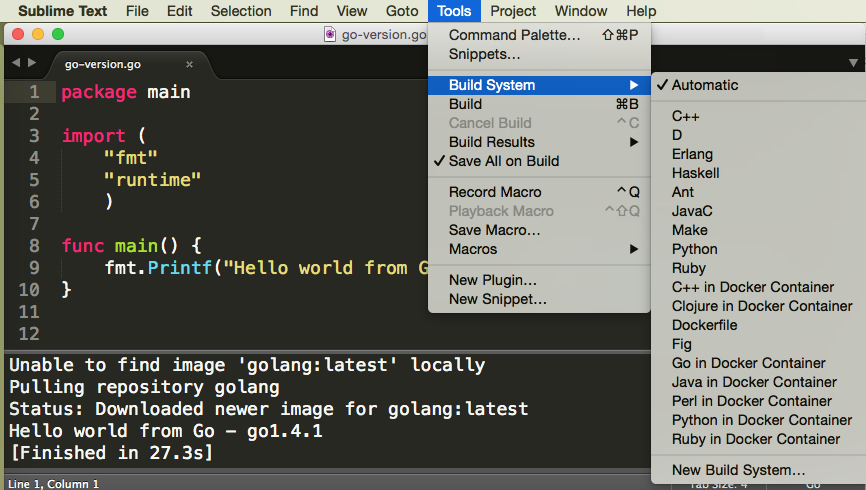
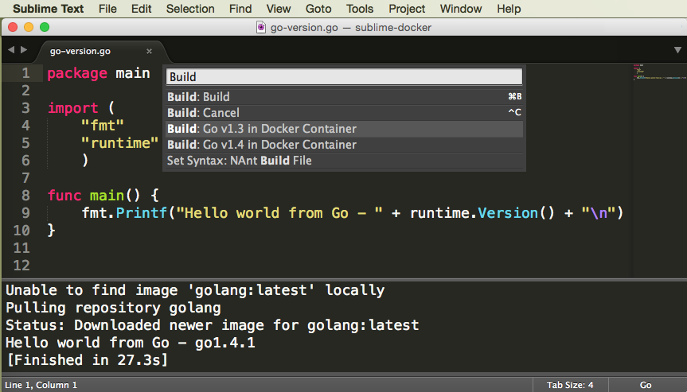
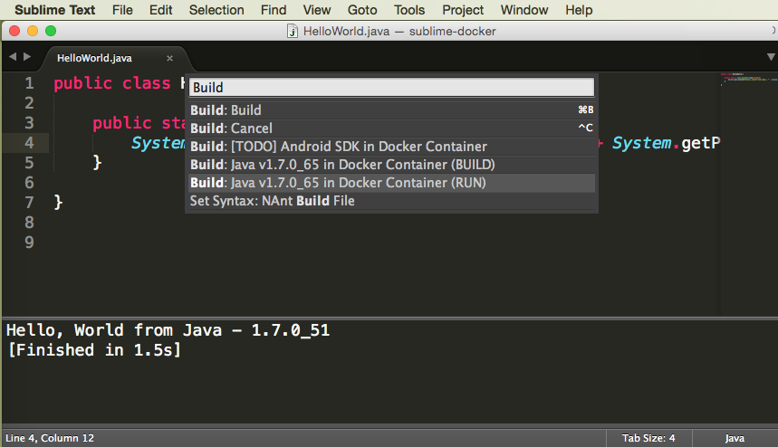
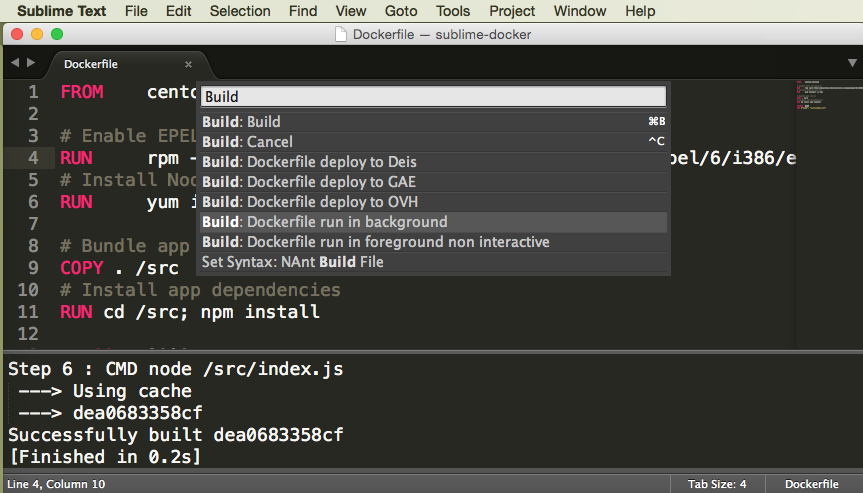
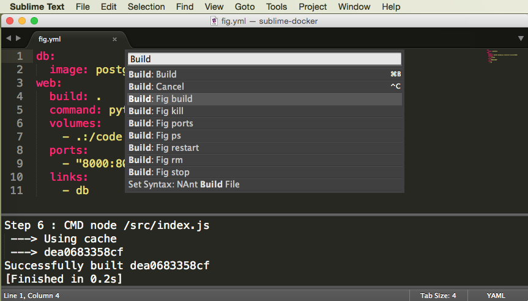

SublimeDocker
=============

A Sublime Text package that include some build systems that use [Docker Language Stacks](http://blog.docker.com/2014/09/docker-hub-official-repos-announcing-language-stacks/). It currently build python, ruby, perl, c/c++ (gcc), clojure, go (golang), java, Dockerfile and Fig configuration files.

# Prerequisite

Requires Docker. You can get it here https://get.docker.com/.

Your user [should belong to the Docker group](https://docs.docker.com/installation/ubuntulinux/#giving-non-root-access) to run docker without using `sudo`.

# Installation

Install using [SublimeText PackageControl](http://wbond.net/sublime_packages/package_control). Otherwise you can also Download/Clone the package and put it in your Packages-directory.

# Usage

After installing, you will find new options in `Tools > Build system` of your Sublime menu: 
- C++ in Docker Container.
- Clojure in Docker Container.
- Dockerfile.
- Fig.
- Go in Docker Container.
- Java in Docker Container.
- Perl in Docker Container.
- Python in Docker Container.
- Ruby in Docker Container.

Remember, always you can launch the selected build with `Control+B` (Linux/Windows) or `Command+B` (OS X).

You can select specific interpreter/compiler variants with  `Control+Shift+P` (Linux/Windows) or `Command+Shift+P` (OS X)
and typing build to reduce the selection to the available build variants for the selected build system as shown below for various language build systems.

